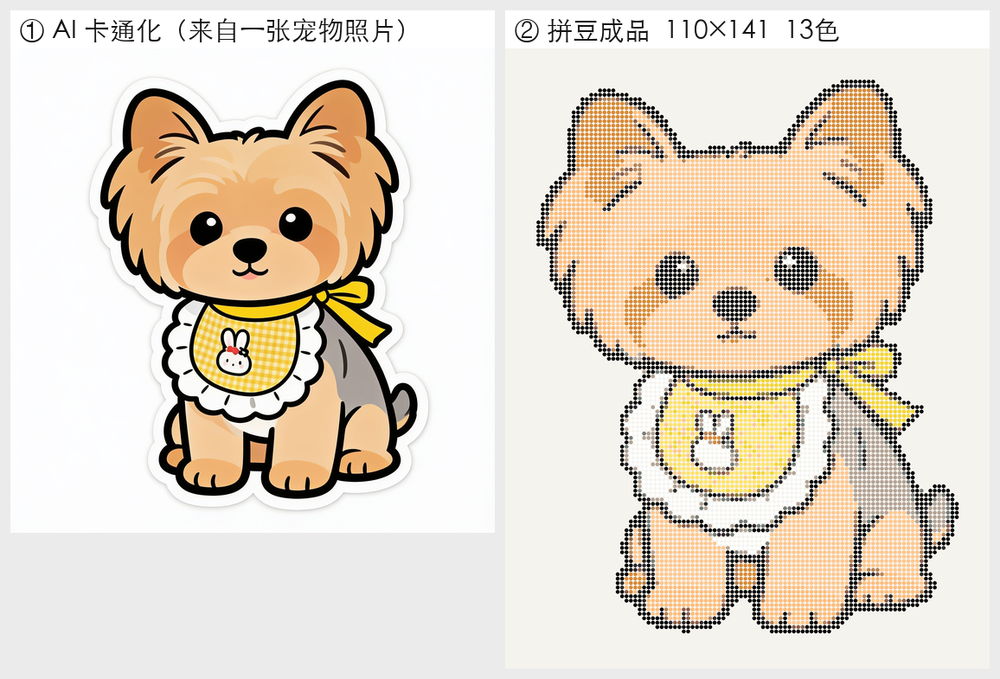
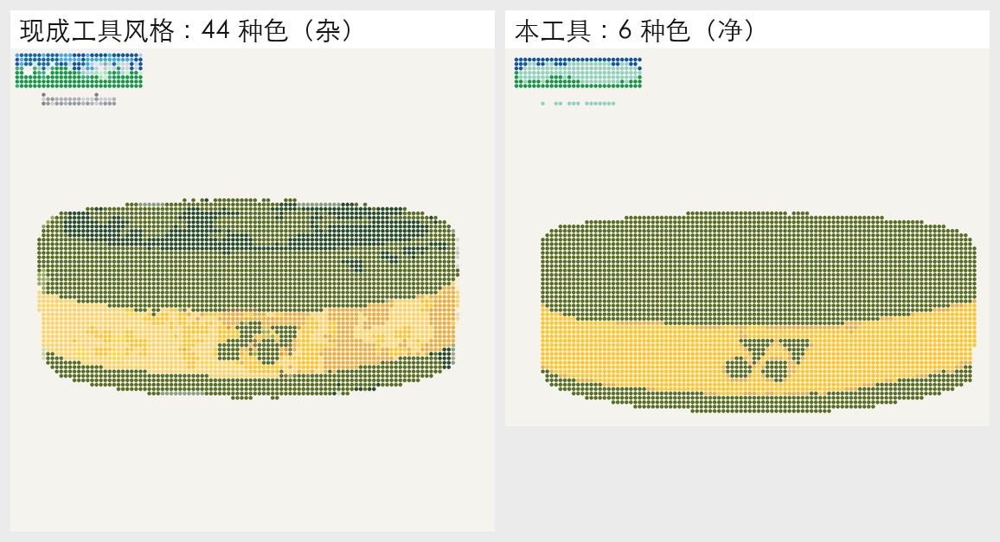
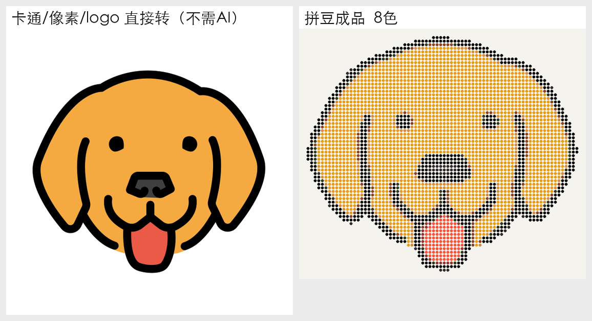

# 拼豆图纸生成器（Perler / Hama Bead Pattern Generator）

把任意图片 → 自动生成**带色号的拼豆指导图 + 配料清单 + 可打印 PDF**。
对**照片**可选先用 AI 重画成干净卡通贴纸，再转拼豆（解决毛茸茸宠物/复杂背景照片直接转会糊掉的问题）。

## 效果亮点
- **全局减色 + 图像分割**：比逐格量化的工具色号少 5–7 倍（一张图常 6–15 色 vs 40–50 色），干净、好拼。
- **AI 卡通化（可选）**：照片 → 扁平卡通贴纸 → 拼豆，宠物特征清晰可辨。
- **真实色卡**：内置 MARD 221 标准色卡（国内五大品牌通用 A/B/C 色号），可切换。
- **可打印 PDF**：第 1 页带编号指导图，第 2 页配料图例（色号 + 颗数）。

## 效果展示

**宠物照片 → AI 卡通化 → 拼豆成品**（毛茸茸的照片直接转会糊，先重画成卡通就清晰可拼）



**vs 现成的逐格量化工具**：同图同色卡，本工具色号少一截、画面更干净（更好买豆、更好拼）



**卡通 / 像素 / logo 直接转**（这类干净输入不需要 AI）



## 目录结构
```
beadgen.py        核心算法（缩放→去背景→全局k-means减色→分割拍平→去杂点→渲染→PDF）
redraw.py         AI 卡通化（OpenRouter 图生图，可选）
app.py            Streamlit 网页界面
palettes/         色卡 json（mard221 / full291），加色卡=加一行注册
examples/         示例图（无隐私）
dev/              实验/评测脚本
```

## 本地运行
```bash
python -m venv .venv && source .venv/bin/activate   # 或用 uv
pip install -r requirements.txt
streamlit run app.py            # 打开 http://localhost:8501
```

## AI 卡通化（可选，需自备图生图 API key）
1. 复制 `.env.example` 为 `.env`，填入你自己的 key。
2. 网页里勾选「AI 卡通化」即可（按图缓存，拖参数不重复扣费）。
3. 不填 key、不勾选，也能正常使用（适合卡通/像素图/logo 这类干净输入）。

支持两个图生图后端，用 `REDRAW_BACKEND` 切换：

| 后端 | `REDRAW_BACKEND` | key 变量 | 默认模型 |
|---|---|---|---|
| OpenRouter（默认） | `openrouter` | `OPENROUTER_API_KEY` | `bytedance-seed/seedream-4.5` |
| 火山方舟 Ark | `volcano` | `ARK_API_KEY` | `doubao-seedream-4-0-*`（可 `REDRAW_MODEL` 改成 seedream 5.0 lite 等） |

> 火山方舟文档：<https://www.volcengine.com/docs/82379/1541523>。切模型只需设 `REDRAW_MODEL` 为控制台给的完整模型 ID。

## 算法管线
图片 →（可选 AI 卡通化）→ 自动裁剪到主体 → 等比缩放到网格 → 剥离背景 →
全局 k-means 减色(Lab 空间) → felzenszwalb 分割拍平 → 最近邻匹配拼豆色号(ΔE) →
去孤立噪点 + 最小色块合并 → 渲染指导图/成品预览 + 配料清单 + PDF

## 在线试用 / 自部署（Streamlit Community Cloud）
1. Fork 本仓库到你的 GitHub。
2. 打开 [share.streamlit.io](https://share.streamlit.io) → New app → 选本仓库、`app.py` → Deploy。
3. （可选）要用 AI 卡通化：App → Settings → Secrets，粘贴 `OPENROUTER_API_KEY = "你的key"`。
   不配置也能用——卡通/像素/logo 这类干净输入直接转豆即可。

## 致谢 / 来源
- 色卡：MARD 221 标准色卡（国内五大品牌通用 A/B/C 色号体系，公开标准）。
- 思路参考了开源项目 [Zippland/perler-beads](https://github.com/Zippland/perler-beads)（七卡瓦），本项目算法为独立实现。
- 示例图 `examples/dog_emoji.png` 来自 [OpenMoji](https://openmoji.org)（CC BY-SA 4.0）。

## License
MIT，见 [LICENSE](LICENSE)。
